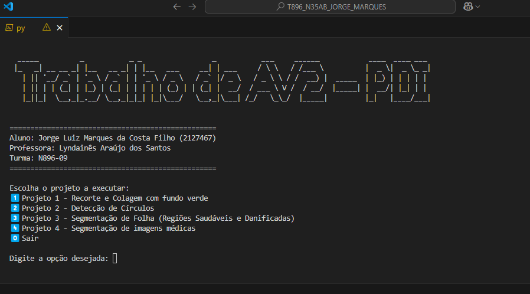

# T896_N35AB_JORGE_MARQUES

Repositório para a disciplina de Processamento Digital de Imagens (PDI)

Trabalho AV2 desenvolvido por **Jorge Luiz Marques da Costa Filho (2127467)**.

## 📋 Pré-requisitos

Para executar esta aplicação, é necessário:

- [Python 3.8+](https://www.python.org/downloads/)
- [Git](https://git-scm.com/downloads)

## 🛠️ Instalação e Execução

Siga os passos abaixo para rodar o projeto:

### 1. Clonar o repositório 🖥️

```bash
git clone https://github.com/jorgeluizmcf/T896_N35AB_JORGE_MARQUES.git
```

```bash
cd T896_N35AB_JORGE_MARQUES
```

### 2. Criar e ativar ambiente virtual 👨🏻‍💻

**Linux/macOS:**

```bash
python3 -m venv venv
```
```bash
source venv/bin/activate
```

**Windows:**

```bash
py -m venv venv
```
```bash
venv\Scripts\activate
```

### 3. Instalar as dependências 📦

```bash
pip install -r requirements.txt
```

### 4. Executar o programa 🏃🏻‍♂️‍➡️

**Linux/macOS:**

```bash
python3 main.py
```

**Windows:**

```bash
py .\main.py
```


**⚠️ Importante: expanda o terminal em altura antes de rodar a aplicação, pois o cabeçalho ASCII pode quebrar em terminais curtos.**





## 🧪 Estrutura dos Projetos
O menu da aplicação permite executar os seguintes projetos:

- Projeto 1: Recorte e composição com remoção de fundo verde.

- Projeto 2: Detecção de círculos com Hough Transform.

- Projeto 3: Segmentação de folhas (áreas saudáveis e danificadas).

- Projeto 4: Segmentação de imagens médicas (detecção de tumor).

As imagens de entrada estão organizadas na pasta datasets/.

##  📝 Licença
Projeto acadêmico — sem fins lucrativos ou distribuição comercial.
